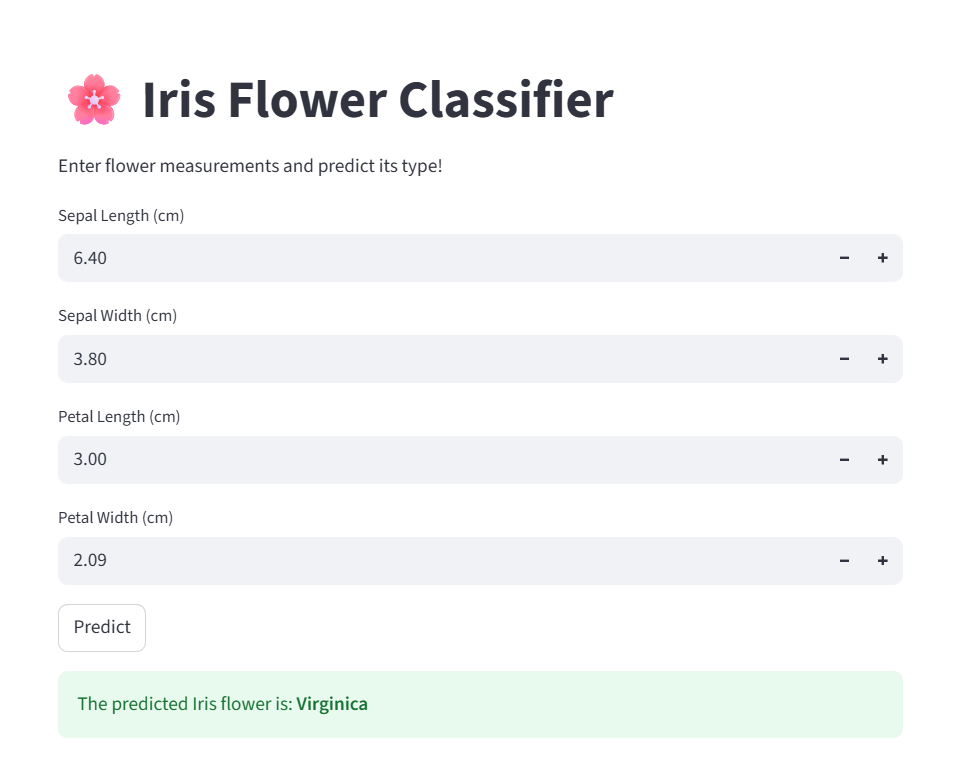

# 🌸 Iris Flower Classifier

This project is a simple machine learning web app that predicts the species of an Iris flower based on its sepal and petal dimensions. It uses the popular Iris dataset and is built using Python, scikit-learn, and Streamlit.

## 📷 Screenshot

## 🚀 Features

- Classifies Iris flower into:
  - Setosa
  - Versicolor
  - Virginica
- Interactive web UI using Streamlit
- Instant predictions from user input
- Built-in Random Forest model with scikit-learn

---
## 📁 Project Structure

## 📦 Requirements
pip install streamlit scikit-learn numpy
